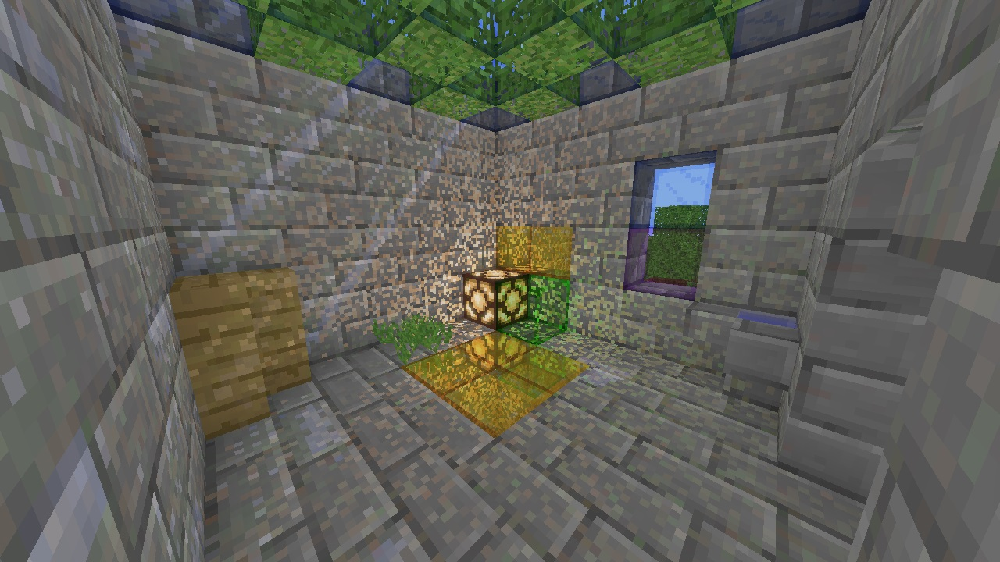

# MinceraftClone

A Minecraft clone rendered using ray tracing



## Features

### Basic features

The game has quite a few features one can expect a Minecraft clone to have, namely:
- ability to place and remove blocks and cubes (more on what cubes are later)
- player and liquid physics
- terrain and structures generation
- loading and saving multiple worlds
- ambient occlusion
- sky and block lighting

Although the feature set is borrowed from Minecraft, the implementation is quite different for a few reasons:
- fixed-point coordinates are used to represent positions
- the basic unit of structure is not a block but a cube

### Cubes

Cube is 1/2 the dimension of a block, so there are 8 cubes in a block.
This subdivision allows for finer control of the shapes of the blocks.
Cubes are used for the majority of the algorithms, like AO and lighting calculations, collision resolution, liquids and physics
(though block coordinates of the cubes are still used for the texture and id lookup for all the blocks excluding liquids).

### Rendering

The rendering, as was mentioned above, is raytracing-based.
This particular implementation allows multiple rays to be casted from a single intersection point.

First, intersections are found, then resolved, and then new rays are created, after which the cycle is repeated until no more rays are created.

The intersection finding algorithm is a modification of a
[DDA](https://en.wikipedia.org/wiki/Digital_differential_analyzer_(graphics_algorithm)) ray caster,
adapted for rendering with chunks, blocks, and cubes (which can have overlaping faces),
and which also allows calculating intersections with arbitrary geometry inside the cubes.

When there are multiple rays casted from a single intersection, they are calculated in depth-first manner.
When there are no more rays in one branch to calculate, results are combined with their parent and other branches are calculated.

All of the results, new rays, and intersections are stored in one local, per-invocation array.

Because the intersection finding algorithm is specialized, such rendering results are possible:


<p align="center"><I>
here reflective and refractive glass and water are touching reflective metal block, water and glass are touching each other, and grass is submerged in water
</I></p>

### Text

Text is rendered using signed distance field bitmap.

[Hiero](https://libgdx.com/wiki/tools/hiero) was used to create [original font image](./assets/font.png) and [characters info](./assets/font.fnt).
[SDF font bitmap](./assets/sdfFont.bmp) is updated automatically whenever the [bitmap font image](./assets/font.bmp) or characters info is updated.
It also can be called manually via
```console
make update_sdf
```
**Note:** the bitmap font image needs to be created manually from the original image if it was updated

## Controls

- Interaction options
  - `Grave accent` ( \` ) - toggle cursor mode (disabled when rotating the camera)
  - `LMB` - break cube / block
  - `RMB` - place block / liquid
  - `WASDQE` - player / spectator camera movement
  - `Space` - player jump
  - `Shift` - increase movement speed
  - `Ctrl` - decrease movement speed / don't replace blocks like leaves and grass when placing blocks onto them
  - `Z` - toggle breaking one cube / full block
  - `X` - toggle liquid placing mode
  - `Scroll wheel` - change selected block

- Camera options
  - `MMB` - enable smooth camera
  - `-` - decrease smooth camera zoom
  - `=` - increase smooth camera zoom

- Some other options
  - `F2` - toggle debug info
  - `F3` - toggle spectator mode
  - `F4` - take screenshot (saved as ./screenshot.bmp)
  - `F5` - toggle trace buffer
  - `F6` - toggle overlay visibility options
  - `Numpad 0-9` - toggle various actions

- Hot reloading
`Ctrl + `
  - `F1` - configuration file
  - `F2` - textures
  - `F3` - buffers
  - `F4` - framebuffers
  - `F5` - shaders
  - `F6` - everything above

- `Esc` - close the game

## Dependencies

(LINUX) g++, make, pkg-config, libglfw, libglfw-dev, libglew2.1, libglew-dev

(WINDOWS) In order to build the project you need to have these programs:

[GNU Make](https://www.gnu.org/software/make/)

[Clang](https://github.com/llvm/llvm-project)

## Quick start

#### Setup the libraries and other utilities

(LINUX) ---

(WINDWS)
```console
setup
```
#### Build and run the game

(LINUX) 
```console
./br.sh
```

(WINDOWS)
```console
make build
game
```

or

```console
br
```

## Libraries

[GLFW](https://www.glfw.org)

[GLEW](http://glew.sourceforge.net)

[PerlinNoise](https://github.com/Reputeless/PerlinNoise)
